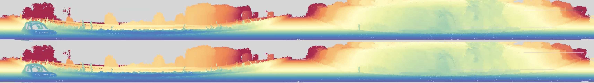
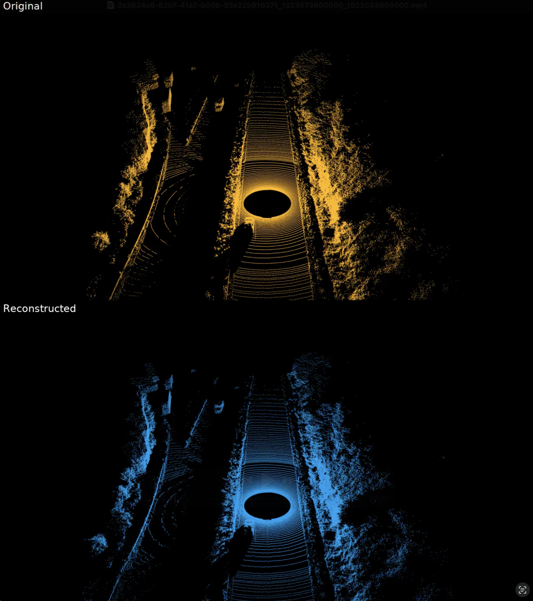

<p align="center">
    
</p>

<h1 align="center">Cosmos-Transfer-LidarGen</h1>


**Cosmos-Transfer-LidarGen** leverages [Cosmos-Predict1](https://github.com/nvidia-cosmos/cosmos-predict1) as the runtime engine to provide specialized models for LiDAR generation tasks. This repository includes:

- **LiDAR Tokenizer**: Continuous latent space tokenizer for encoding and decoding LiDAR point cloud data with 8x8 spatial compression
- **Cosmos-Transfer-LidarGen Diffusion Model**: Multi-view RGB image to LiDAR range map generation using diffusion-based architecture
- **Post-training Scripts**: Tools for fine-tuning models on custom LiDAR datasets with multi-gpu support
- **Inference Scripts**: Easy-to-use interfaces for generating LiDAR data from trained models


## Getting Started

We provide comprehensive examples to illustrate how to perform inference and post-training with Cosmos-Transfer-LidarGen models.

### Installation

Please refer to [INSTALL.md](INSTALL.md) for general instructions on environment setup.

Additional LiDAR-specific dependencies:
```bash
# Required for plotly visualization
apt-get -y install libnss3 libatk-bridge2.0-0 libcups2 libxcomposite1 libxdamage1 libxfixes3 libxrandr2 libgbm1 libxkbcommon0 libpango-1.0-0 libcairo2
plotly_get_chrome

# Additional libraries for LiDAR processing
pip install jaxtyping kaleido pyquaternion av lru-dict OpenEXR==3.2.3 plotly open3d
```

### Download sample datasets
1. Generate a [Hugging Face](https://huggingface.co/settings/tokens) access token (if you haven't done so already). Set the access token to `Read` permission (default is `Fine-grained`).

2. Log in to Hugging Face with the access token:
   ```bash
   huggingface-cli login
   ```
3. Download the sample dataset
    ```
    from huggingface_hub import snapshot_download
    snapshot_download(repo_id="nvidia/Cosmos-Transfer-LidarGen-Example",local_dir="datasets",repo_type="dataset")
    ```

## LiDAR Tokenizer

The LiDAR tokenizer enables efficient encoding and decoding of LiDAR point cloud data using continuous latent space representations.

**Model Performance:**
| Model Name                          | RMSE (m)  | MAE (m)   | Relative Error |
|-------------------------------------|-----------|-----------|----------------|
| Cosmos-Tokenize1-CI8x8-360p (Image) | 1.302     | 0.450     | 0.022          |
| Cosmos-Tokenizer-CI8x8-Lidar | 0.289     | 0.218     | 0.011          |

Fine-tuning on LiDAR range map data achieves significant improvements in reconstruction accuracy.

### Post-training LiDAR Tokenizer
* [Post-train tokenizer using custom LiDAR datasets](examples/lidar_tokenizer.md) **[with multi-GPU support]**

### Inference with LiDAR Tokenizer
* [Autoencoding LiDAR point clouds](examples/lidar_tokenizer.md)

## Cosmos-Transfer-LidarGen Diffusion Model

The RGB-conditioned LiDAR generation model generates LiDAR range maps from multi-view RGB images, enabling 3D spatial understanding for 2D visual data.

**Model Performance:**
We run inference on 200 samples and compute the chamfer distance between the generated lidar and the real lidar within the range of [5, 65] meters, here are some statics:

| Total Samples | Best | Average  | Median   |
|---------------|-----------------|----------|----------|
| 200           | 0.541117        | 3.007317 | 2.130677 |


**Model Architecture:**
- **Base Model**: Diffusion-based architecture similar to Single2MultiView
- **Input**: Multi-view RGB images (3 views: front, rear left, rear right)
- **Output**: LiDAR range maps

### Post-training Cosmos-Transfer-LidarGen Model
* [Post-train Cosmos-Transfer-LidarGen model using custom multi-view datasets](examples/lidar_diffusion.md) **[with multi-node support]**

### Inference with Cosmos-Transfer-LidarGen Model
* [Generate LiDAR from RGB images](examples/lidar_diffusion.md) **[with multi-GPU support]**

## Visualization Examples

### LiDAR Tokenizer Output

**Range Map Visualization**



**Point Cloud Visualization**



### Cosmos-Transfer-LidarGen Output

**Multi-View RGB to LiDAR Generation**


The visualization shows:
- **First row**: Overlaid input views and generated LiDAR point cloud
- **Second row**: Reference LiDAR range map (left) and generated map (right)
- **Third row**: 3D view of both point clouds


## License and Contact

This project will download and install additional third-party open source software projects. Review the license terms of these open source projects before use.

This model includes safety and content moderation features powered by Llama Guard 3. Llama Guard 3 is used solely as a content input filter and is subject to its own license.

NVIDIA Cosmos source code is released under the [Apache 2 License](https://www.apache.org/licenses/LICENSE-2.0).

NVIDIA Cosmos models are released under the [NVIDIA Open Model License](https://www.nvidia.com/en-us/agreements/enterprise-software/nvidia-open-model-license). For a custom license, please contact [cosmos-license@nvidia.com](mailto:cosmos-license@nvidia.com).
