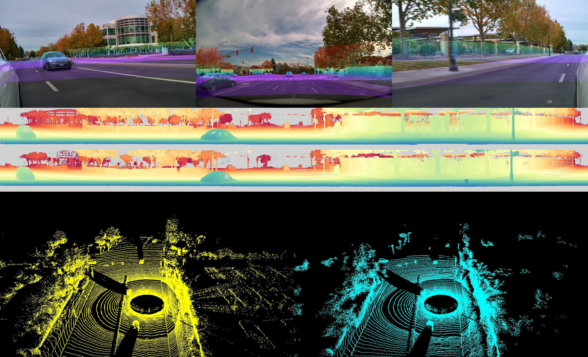

## Post-training and Inference with Cosmos-Transfer-LidarGen Models

### Model Overview

The Cosmos-Transfer-LidarGen diffusion model enables 3-view RGB image to LiDAR point cloud generation. This model takes multi-view RGB images as input and generates corresponding LiDAR range maps, bridging the gap between visual perception and 3D spatial understanding.

### Environment setup

Please refer to [lidar_tokenizer.md](lidar_tokenizer.md) for instructions on environment setup.

### Model Support Matrix

We support the following Cosmos-Transfer-LidarGen models for post-training and inference:

| Model Name                                | Model Status   | Compute Requirements for Post-Training |
|-------------------------------------------|----------------|----------------------------------------|
| Cosmos-Transfer-LidarGen             | **Supported**  | 1+ NVIDIA GPUs*                       |

**\*** `H100-80GB` or `A100-80GB` GPUs are recommended.

### Download checkpoints

1. Generate a [Hugging Face](https://huggingface.co/settings/tokens) access token (if you haven't done so already). Set the access token to `Read` permission (default is `Fine-grained`).

2. Log in to Hugging Face with the access token:
   ```bash
   huggingface-cli login
   ```

3. Download the [model](https://huggingface.co/nvidia/Cosmos-Transfer-LidarGen) and [tokenizer](https://huggingface.co/nvidia/Cosmos-Tokenizer-CI8x8-Lidar) checkpoints:
   ```bash
   from huggingface_hub import snapshot_download
    snapshot_download(repo_id="nvidia/Cosmos-Transfer-LidarGen",local_dir="checkpoints/Cosmos-Transfer-LidarGen")
    snapshot_download(repo_id="nvidia/Cosmos-Tokenizer-CI8x8-Lidar",local_dir="checkpoints/Cosmos-Tokenizer-CI8x8-Lidar")
   ```

## Post-training Cosmos-Transfer-LidarGen Models

Post-training a Cosmos-Transfer-LidarGen model allows you to fine-tune the model for your specific multi-view RGB to LiDAR generation use cases.

### Dataset Preparation

You must provide synchronized multi-view RGB images and LiDAR point cloud data in a compatible format. The dataset should be organized as follows:

```
datasets/lidar_dataset_release/
├── metadata/
│   └── *.npz                           # LiDAR metadata files
├── lidar/
│   └── *.tar                           # LiDAR point cloud data
├── pose/
│   └── *.tar                          # Camera pose information
├── ftheta_intrinsic/
│   └── *.tar                          # Camera intrinsic parameters
├── ftheta_camera_front_wide_120fov/
│   └── *.mp4                           # Front camera videos
├── ftheta_camera_rear_left_70fov/
│   └── *.mp4                           # Rear left camera videos
└── ftheta_camera_rear_right_70fov/
    └── *.mp4                           # Rear right camera videos

```

### Post-training Configuration

The Cosmos-Transfer-LidarGen diffusion model uses a custom experiment configuration. See the config [text2world_imagetolidar](../cosmos_predict1/diffusion/training/config/text2world_imagetolidar/experiment.py) defined in the training configuration files to understand how the dataloader and model are configured.


### Post-training Command

Run the following command to execute a post-training job for the Cosmos-Transfer-LidarGen model:

```bash
N_GPUS=8
torchrun --nproc_per_node=$N_GPUS --nnodes=1 --rdzv_id 123 --rdzv_backend c10d --rdzv_endpoint $MASTER_ADDR:1234 \
    -m cosmos_predict1.diffusion.training.train \
    --config=cosmos_predict1/diffusion/training/config/config_lidar.py \
    -- experiment=text2world_imagetolidar \
    checkpoint.load_path=""
```

The checkpoints will be saved to `${OUTPUT_ROOT}/PROJECT/GROUP/NAME`.
In this case: `checkpoints/posttraining/diffusion_text2world/text2world_imagetolidar/`

During training, the checkpoints will be saved in the following structure:
```bash
checkpoints/posttraining/diffusion_text2world/text2world_imagetolidar/checkpoints/
├── iter_{NUMBER}_reg_model.pt
├── iter_{NUMBER}_ema_model.pt
```

## Inference with Cosmos-Transfer-LidarGen Models

### Command Line Arguments
Please see [inference helper](../cosmos_predict1/diffusion/inference/imagetolidar_cli.py) to understand different arguments.

### RGB to LiDAR Generation

The Cosmos-Transfer-LidarGen model can generate LiDAR range maps from multi-view RGB images.

```bash
# Basic inference with ImageToLidar model
n_gpus=1
experiment=text2world_imagetolidar
ckpt_path=checkpoints/osmos-Transfer-LidarGen/model.pt

torchrun --master_port=29502 --nproc_per_node=$n_gpus cosmos_predict1/diffusion/inference/imagetolidar_cli.py \
    --save_dir dump_results/test_image2lidar_inference \
    --checkpoint $ckpt_path \
    --experiment $experiment \
    --filter_outlier \
    -- experiment=$experiment \
    dataloader_train.batch_size=1
```

### Multi-GPU Inference

For faster inference with multiple GPUs:

```bash
n_gpus=8
experiment=text2world_imagetolidar
ckpt_path=checkpoints/ImageToLidar/model.pt

torchrun --master_port=29502 --nproc_per_node=$n_gpus cosmos_predict1/diffusion/inference/imagetolidar_cli.py \
    --save_dir dump_results/test_image2lidar_inference_4gpu \
    --checkpoint $ckpt_path \
    --experiment $experiment \
    --filter_outlier \
    -- experiment=$experiment 
```

### Output
Output files are saved in the specified `--save_dir` directory with the following structure:
```
save_dir
    └── *.jpg      
```
The first row displays the overlaid input views and the generated LiDAR point cloud. The second row presents two LiDAR range maps: the reference map from the dataset on the left, and our generated map on the right. Finally, the third row shows a 3D view of both point clouds.

#### Range Map Visualization



## Model Architecture

The Cosmos-Transfer-LidarGen diffusion model is built on the following architecture:

- **Base Model**: similar to Single2Multiview model
- **Input**: Multi-view RGB images (3 views: front, left, right)
- **Output**: LiDAR range maps with spatial correspondence


##  Troubleshooting

- **Memory Issues**: 
  - Ensure sufficient GPU memory (recommend 80GB+ per GPU)

- **Dataset Requirements**
    - Minimum Dataset Size: 10,000+ synchronized RGB-LiDAR pairs recommended
    - View Coverage: Ensure good coverage of different scenarios and environments
    - Calibration: Accurate camera-LiDAR calibration is crucial for quality results
